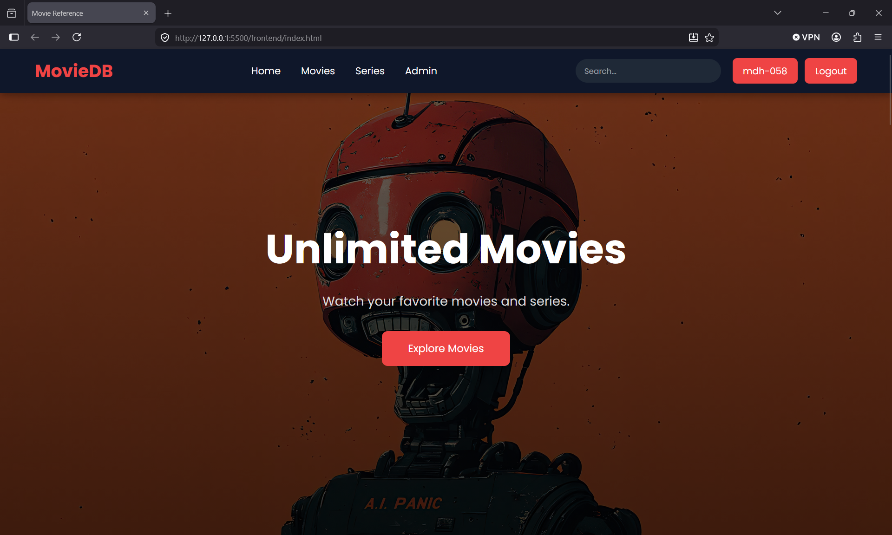
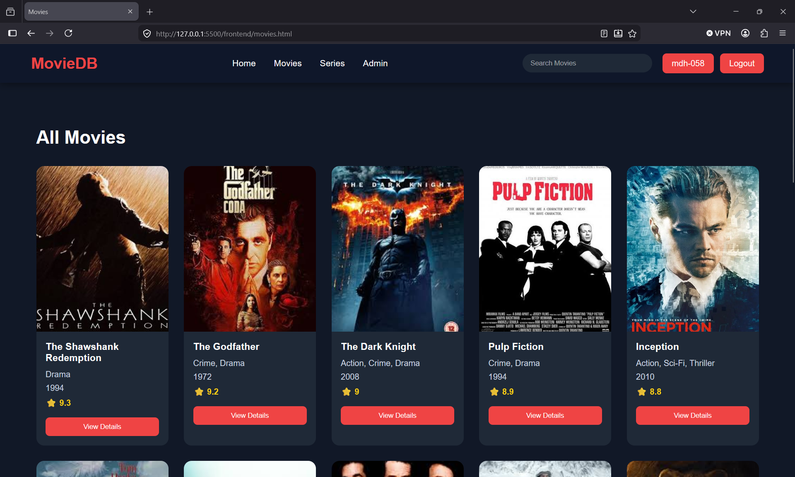
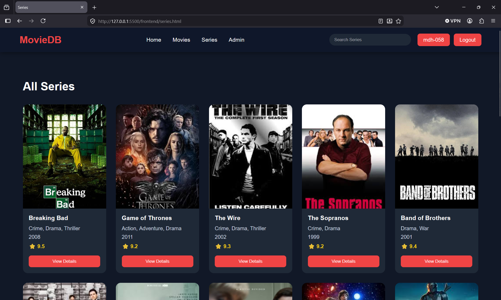
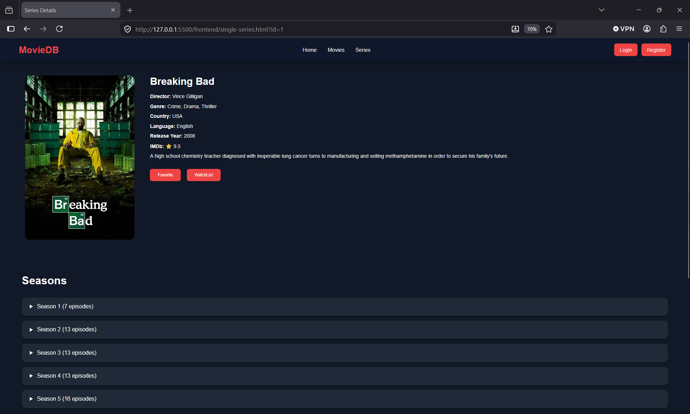
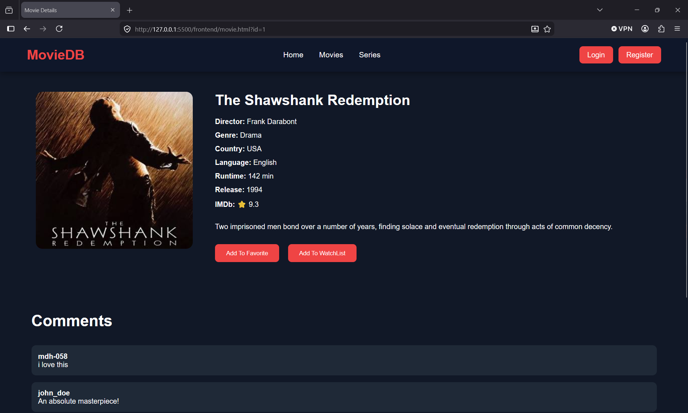
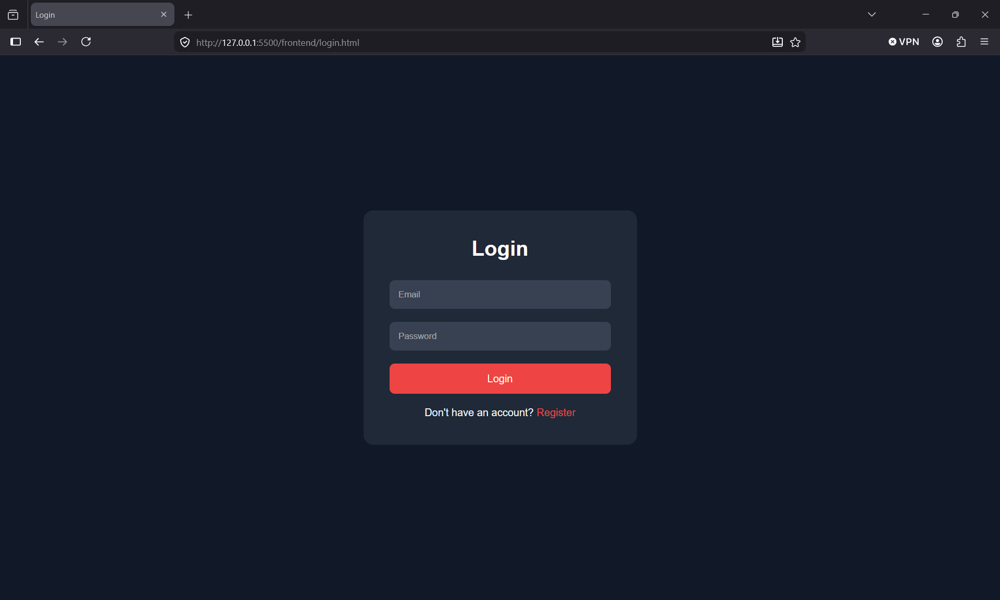
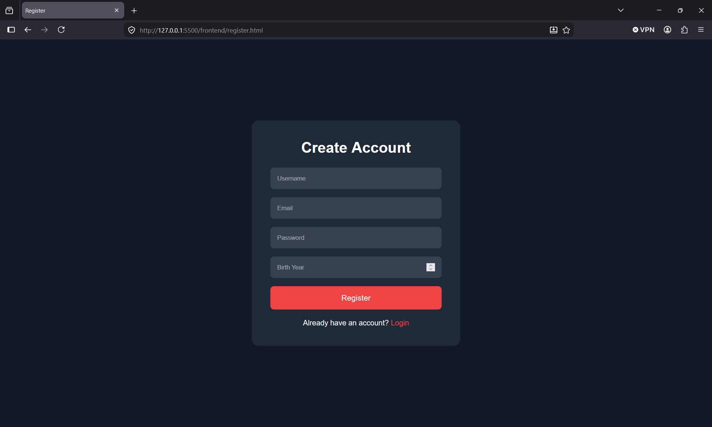
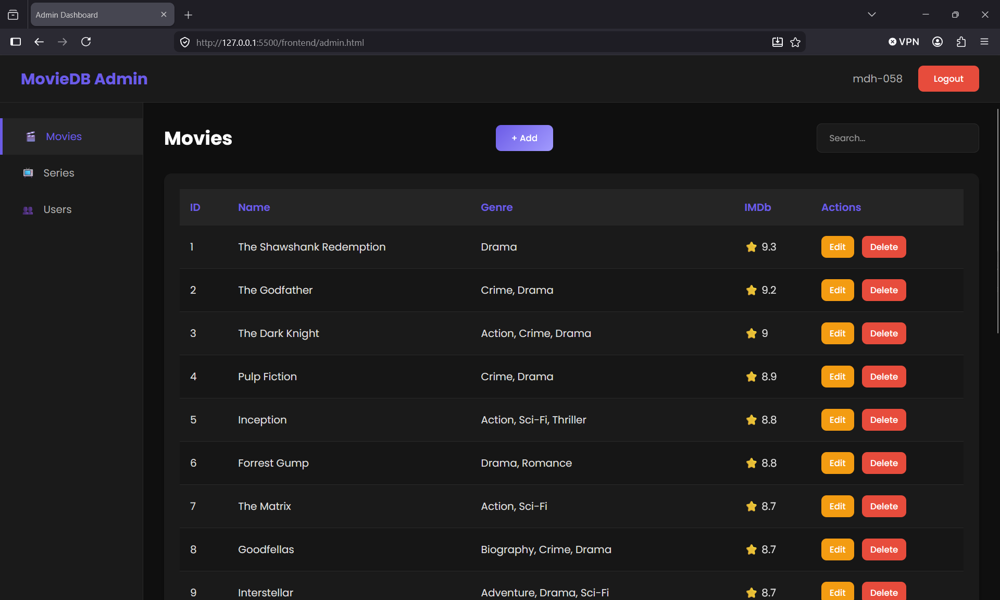

# 🎬 Movie Streaming Database System

A simple Movie & Series Management System developed for a **University Database Course**.

The project demonstrates how to build a complete CRUD application using **Node.js**, **Express.js**, **MySQL**, and **Vanilla JavaScript**.

---

# ✨ Features

## User

- Register
- Login
- Browse Movies
- Browse Series
- View Movie Details
- View Series Details
- Add Favorites
- Add Watchlist
- Add Comments

---

## Admin

- Secure Login
- View Users
- Change User Role
- Delete Users

### Movie Management

- Add Movie
- Edit Movie
- Delete Movie

### Series Management

- Add Series
- Edit Series
- Delete Series

---

# 🛠️ Technologies

## Backend

- Node.js
- Express.js
- MySQL
- JWT Authentication
- bcrypt

## Frontend

- HTML5
- CSS3
- Vanilla JavaScript

## Database

- MySQL

---

# 📂 Project Structure

```
backend/
│
├── config/
├── controllers/
├── middleware/
├── models/
├── routes/
├── uploads/
├── database/
│
├── app.js
└── package.json

frontend/
│
├── css/
├── js/
├── images/
│
├── index.html
├── login.html
├── register.html
├── movies.html
├── movie.html
├── series.html
├── single-series.html
├── profile.html
└── admin.html
```

---

# 🚀 Installation

## Clone Repository

```bash
git clone https://github.com/YOUR_USERNAME/movie-streaming-database-system.git
```

---

## Install Backend

```bash
cd backend
npm install
```

---

## Configure Environment

Create a `.env` file inside the backend folder.

```env
DB_HOST=localhost
DB_USER=root
DB_PASSWORD=YOUR_PASSWORD
DB_NAME=movie_project
JWT_SECRET=movie_project_secret
```

---

## Import Database

Import:

```
database/schema.sql
```

into MySQL.

---

## Run Backend

```bash
npm run start
```

or

```bash
node app.js
```

---

## Open Frontend

Simply open:

```
frontend/index.html
```

or run it using **Live Server** in VS Code.

---

## 📸 Screenshots

### 🏠 Home Page



---

### 🎬 Movies Page



---

### 📺 Series Page



---

### 🎥 Movie Details Page



---

### 📼 Series Details Page



---

### 👤 Login Page



---

### 📝 Register Page



---

### 🛠️ Admin Dashboard


---

# 📚 Educational Purpose

This project was created as a university database course project to demonstrate:

- MySQL Database Design
- CRUD Operations
- Authentication
- Role-Based Authorization
- REST API Development
- Frontend & Backend Integration

---

# 📄 License

This project is for educational purposes.
